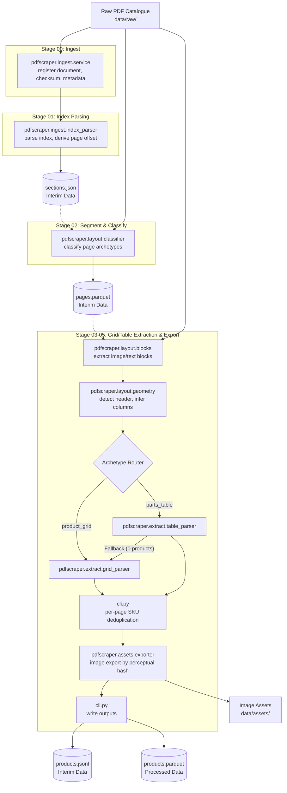
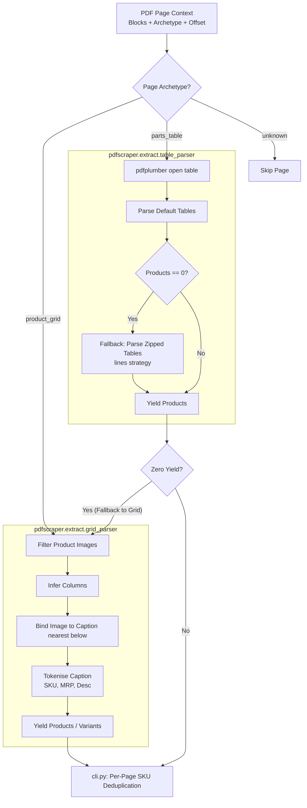

# Architecture of the JAL Catalogue Scraper

This document describes the pipeline stages, modules, artifacts, and parsing flows that form the `pdfscraper` engine, based on the implementation in stages 00 through 05.

## High-Level Pipeline Diagram (Stages 00 - 05)

The pipeline is primarily orchestrated through `pdfscraper/cli.py` and processes the catalogue systematically from raw PDF to structured outputs and deduplicated images.

## Low-Level Parsing Flow (Stages 03 - 05)

The extraction of product data relies heavily on routing pages based on their classified archetype, with built-in fallbacks to ensure maximum extraction yield.

## Component Intricacies & Responsibilities

Here is a breakdown of what each module does and how it connects to the rest of the pipeline:

### 1. `pdfscraper.ingest`
- **`service.py`**: Executes **Stage 00**. Reads the raw PDF, generates a SHA-256 checksum for verification, and parses top-level catalogue metadata (e.g., effective date, total pages).
- **`index_parser.py`**: Executes **Stage 01**. Reads the Table of Contents (INDEX), maps printed pages to PDF pages, dynamically deduces the `PRINTED_TO_PDF_PAGE_OFFSET`, and outputs `interim_data/sections.json`. This provides the crucial section context (which product series corresponds to which page range) used by downstream stages.

### 2. `pdfscraper.layout`
- **`classifier.py`**: Executes **Stage 02**. Classifies every page into archetypes (e.g., `product_grid`, `parts_table`, or `unknown`). Produces `pages.parquet`, which dictates the extraction strategy in Stages 03-05.
- **`blocks.py`**: A foundational utility that uses PyMuPDF to extract raw geometries (text and images) from a given page, normalizing them into `RawBlock` schemas.
- **`geometry.py`**: Implements spatial heuristics. It detects series headers on a page (to name the products), infers grid columns, filters out decorative PDF elements, and associates (binds) image blocks to the caption text block immediately below them.

### 3. `pdfscraper.extract`
- **`grid_parser.py`**: The heavy lifter for `product_grid` pages. 
  - Depends on `geometry.py` to get image-caption bindings.
  - Passes captions to `caption_grammar.tokenise_caption` to extract SKUs, prices (MRP), and descriptions using deterministic regex rules (no LLMs). 
  - Constructs `Product` entities with spatial confidence scores and multiple `Variant`s if multiple SKUs exist in one block.
- **`table_parser.py`**: Handles `parts_table` pages using `pdfplumber`. 
  - Attempts a default table extraction first. 
  - If that fails, it falls back to a zipped text-lines strategy (`_parse_zipped_tables`).
  - **Connection/Fallback**: As orchestrated in `cli.py`, if the `TableParser` yields 0 products on a parts page, the system dynamically intercepts and falls back to running the `GridParser` over the same page. This fallback fires whenever `TableParser` yields zero products; it succeeded on page 193 (yielding 6 products) and failed on page 196, which remains a known gap requiring manual entry.

### 4. `pdfscraper.assets`
- **`exporter.py`**: Operates at the end of the extraction loop (Stage 05).
  - Takes the flattened list of `Product`s and deduplicates identical images via perceptual hash (`phash_to_asset_id`), saving them neatly to `data/assets/`.
  - **Note:** It does **not** perform SKU deduplication; that logic lives in `cli.py` and is scoped per-page to retain the variant with the highest confidence score.
  - It also does not write the `products.jsonl` or `products.parquet` artifacts. Those artifacts are written by `cli.py` immediately after `export_assets` completes.
